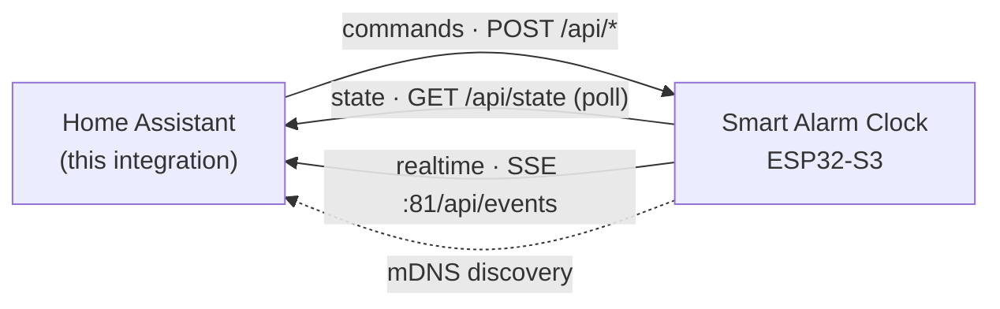

# ⏰ Smart Alarm Clock — Home Assistant integration

_Local-push Home Assistant integration for the DIY [smart-alarm-clock][device] —
an ESP32-S3 bedside clock that's dark & silent until summoned._

[![GitHub Release][release-shield]][release]
[![HACS Custom][hacs-shield]][hacs]
[![Validate][validate-shield]][validate]
[![License][license-shield]](LICENSE)
![Maintenance][maintenance-shield]

Talks to the device's **local** REST API and streams changes over Server-Sent
Events — instant updates, no cloud, **no MQTT broker required**.

---

## ✨ Features

- 🔌 **Local push** (`iot_class: local_push`) — state arrives over SSE the moment
  it changes on the device; a 60 s poll is the fallback.
- 🔎 **Zero-config discovery** — the clock advertises over mDNS, so Home
  Assistant offers it automatically.
- 🌙 **Display switch** — turn every light-emitting component on/off ("dark until
  summoned"); a firing alarm always lights up regardless.
- ⏱️ **Full alarm control** — enable/disable and set the time for each slot,
  snooze and dismiss, and a live phase sensor.

## 📦 Installation

### HACS (recommended)

[![Open your Home Assistant instance and open this repository inside HACS.][hacs-repo-shield]][hacs-repo]

1. Click the button above, **or** in HACS go to **⋮ → Custom repositories**, add
   `https://github.com/MartBent/homeassistant-smart-alarm-clock` with type
   **Integration**.
2. Search for **Smart Alarm Clock** in HACS and **Download** it.
3. **Restart Home Assistant.**

### Manual

Copy `custom_components/smart_alarm_clock/` into your Home Assistant
`config/custom_components/` directory, then restart Home Assistant.

## ⚙️ Setup

After installing and restarting:

[![Add the Smart Alarm Clock integration to your Home Assistant instance.][config-shield]][config]

- **Auto-discovery:** the device shows up under **Settings → Devices & Services**
  as _“Smart Alarm Clock discovered”_ → **Configure**.
- **Manual:** **Settings → Devices & Services → Add Integration → Smart Alarm
  Clock** → enter the device's IP address.

> [!TIP]
> Give the device a DHCP reservation (or rely on mDNS) so its address stays
> stable.

## 🧩 Entities

All under a single **Smart Alarm Clock** device:

| Entity | Type | Description |
| --- | --- | --- |
| Phase | `sensor` | `syncing` / `idle` / `armed` / `ringing` / `snoozed` |
| Time | `sensor` | the device's own wall clock |
| Display | `switch` | all lights on/off (a firing alarm lights up anyway) |
| Alarm _N_ | `switch` | enable/disable a slot — enabling arms the clock |
| Alarm _N_ time | `time` | edit a slot's alarm time |
| Snooze | `button` | snooze while ringing |
| Dismiss | `button` | dismiss while ringing (disables the fired slot — one-shot) |

> [!NOTE]
> There's no explicit _Armed_ switch: the clock is armed whenever any alarm is
> enabled, and dismissing a ringing alarm turns that slot off.

## 🔧 How it works

- **Commands** → `POST /api/command`, `/api/alarm/enabled`, `/api/alarm/time`.
- **State** → `GET /api/state` (60 s polling fallback).
- **Realtime** → the device streams changes over SSE on `:81/api/events`.

## 🛠️ Firmware & hardware

The device firmware, hardware (KiCad), and design docs live in the main repo:
**[MartBent/smart-alarm-clock][device]**.

## 📄 License

Released under the [MIT License](LICENSE).

<!-- Badges -->
[device]: https://github.com/MartBent/smart-alarm-clock
[release-shield]: https://img.shields.io/github/release/MartBent/homeassistant-smart-alarm-clock.svg
[release]: https://github.com/MartBent/homeassistant-smart-alarm-clock/releases
[hacs-shield]: https://img.shields.io/badge/HACS-Custom-41BDF5.svg
[hacs]: https://hacs.xyz
[validate-shield]: https://github.com/MartBent/homeassistant-smart-alarm-clock/actions/workflows/validate.yml/badge.svg
[validate]: https://github.com/MartBent/homeassistant-smart-alarm-clock/actions/workflows/validate.yml
[license-shield]: https://img.shields.io/github/license/MartBent/homeassistant-smart-alarm-clock.svg
[maintenance-shield]: https://img.shields.io/maintenance/yes/2026.svg
[hacs-repo-shield]: https://my.home-assistant.io/badges/hacs_repository.svg
[hacs-repo]: https://my.home-assistant.io/redirect/hacs_repository/?owner=MartBent&repository=homeassistant-smart-alarm-clock&category=integration
[config-shield]: https://my.home-assistant.io/badges/config_flow_start.svg
[config]: https://my.home-assistant.io/redirect/config_flow_start/?domain=smart_alarm_clock
